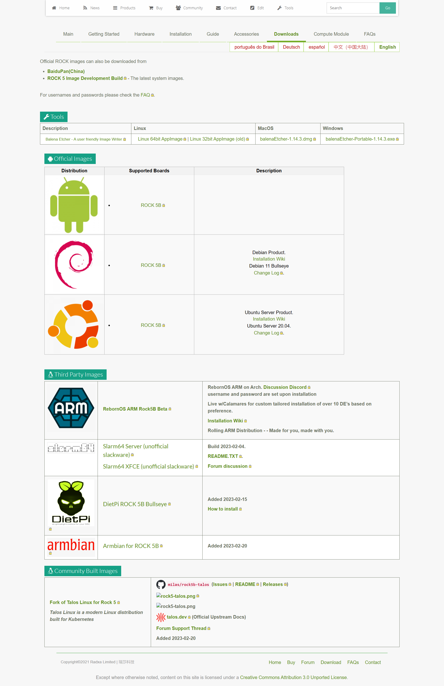
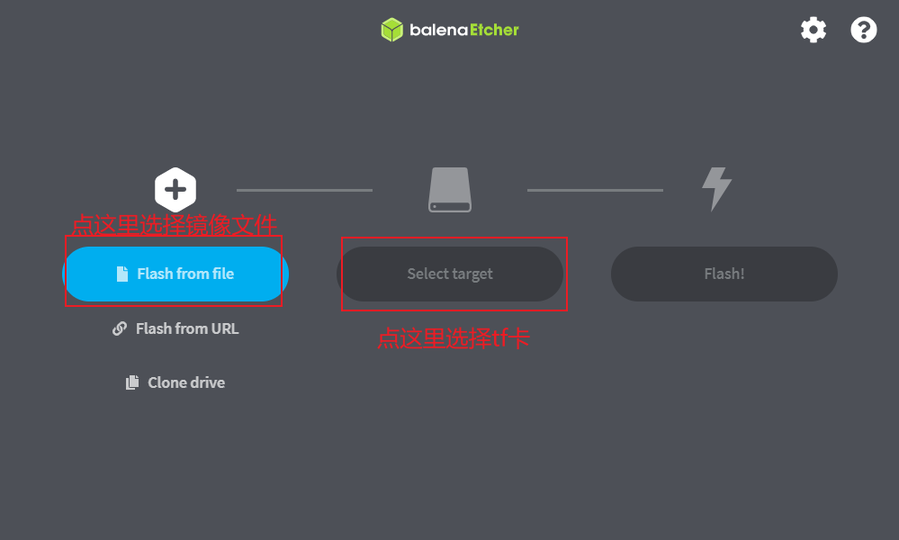
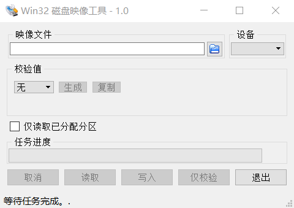
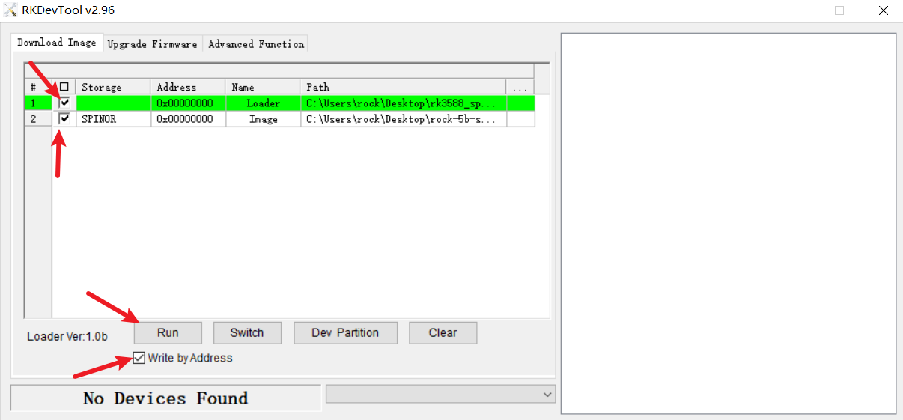
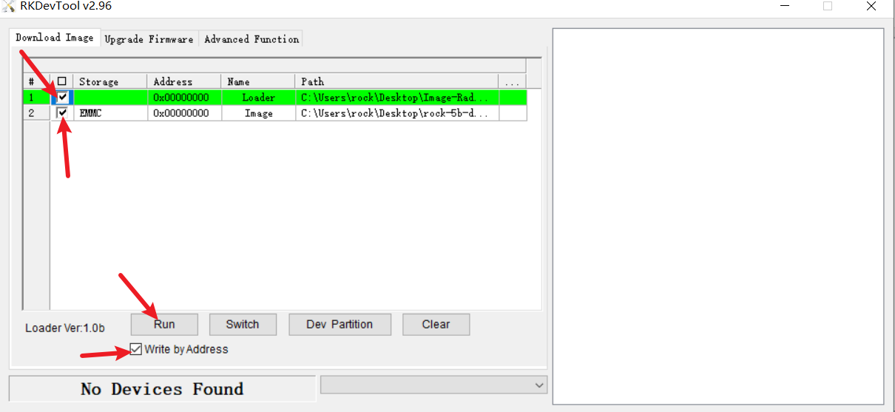
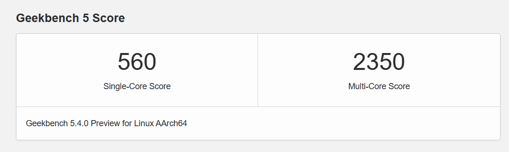
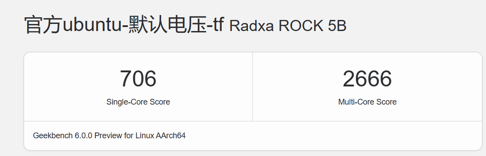
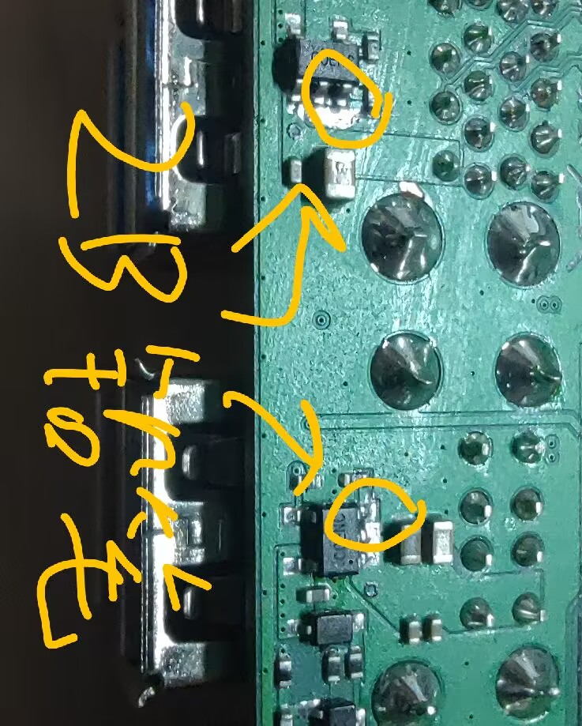

# 一.Rock_5b使用介绍

## 1.所需配件

### 存储

tf卡、emmc、nvme任选其一

### 系统镜像文件

#### [官方系统下载](https://github.com/radxa/debos-radxa/releases)

包括ubuntu、debian、安卓

**官方系统账户密码 rock rock**
**armbian没用自己创建密码, 默认是 root 1234**

#### 自行编译armbian

>   注意boot要改成fat格式
>
>   BOOTFS_TYPE="fat"

#### [整合包系统下载](https://github.com/amazingfate/armbian-rock5b-images/releases)@[amazingfate](https://github.com/amazingfate)

#### [Openwrt](https://pan.baidu.com/s/1GvFl6QH0loFjlHhsWrPBtQ?pwd=u7ae)
[阿里云盘链接](https://www.aliyundrive.com/s/sNDgnCepcyy)

#### [Uos](https://pan.baidu.com/s/1beBSJEWxgWKDRN8aDCr1BQ?pwd=j7hn)
[阿里云盘链接](https://www.aliyundrive.com/s/UsBL7cdfe5c)

#### 基于Arch的RebornOs

https://github.com/RebornOS-Developers/lxqt-rock5b-image

[RebornOS论坛链接](https://forum.radxa.com/t/arch-based-rebornos-reviewed-on-rock5b/14237/39)

https://forum.radxa.com/t/arch-based-rebornos-reviewed-on-rock5b/14237/5

[Reborn OS安装wiki](https://wiki.rebornos.org/arm/install)

### spi下载

[loader](https://dl.radxa.com/rock5/sw/images/loader/rock-5b/rk3588_spl_loader_v1.08.111.bin)

[官方spi-debug版](https://dl.radxa.com/rock5/sw/images/loader/rock-5b/debug/rock-5b-spi-image-g3caf61a44c2-debug.img)

[官方spi-关闭uboot串口输出](https://dl.radxa.com/rock5/sw/images/loader/rock-5b/release/rock-5b-spi-image-g49da44e116d.img)

[armbianspi](https://github.com/huazi-yg/rock5b/releases/download/rock5b/rkspi_loader.img)

[zero-擦除spi](https://dl.radxa.com/rock5/sw/images/others/zero.img.gz)

## [SDK](https://gitlab.com/rk3588_linux/linux)

### [rk驱动](https://dl.radxa.com/tools/windows/DriverAssitant_v5.0.zip)

## [RKDevTool](https://dl.radxa.com/tools/windows/RKDevTool_Release_v2.96-20221121.rar)

### [balenaEtcher](https://www.balena.io/etcher/)

### [Win32Diskimager](https://sourceforge.net/projects/win32diskimager/)

## 2.win刷写镜像

### 2.1.tf卡

+   使用 balenaEtcher 烧录

>   1.   使用读卡器把 TF 卡插入电脑
>   2.   使用解压软件解压镜像压缩包，解压后的文件中，以“ .img”结尾的文件就是操作系统的
>        镜像文件
>   3.   运行balenaEtcher，选择镜像文件和tf卡
>   

+   使用 Win32Diskimager 烧录



### 2.2.NVME固态

+   下载loader和对应的spi
+   下载RKDevTool和rk驱动，安装rk驱动，按住mskrom按钮后上电
+   打开RKDevTool，右键，`load config` 选择rock-5b-spinor.cfg



+   spinor选择你下载的spi，loader选择下载的loader，点击`run`刷写spi

+   按照刷写镜像到tf卡一样操作刷到nvme，插入5b通电开机

### 2.3 emmc

+   下载loader和系统镜像
+   下载RKDevTool和rk驱动，安装rk驱动，按住mskrom按钮后上电
+   打开RKDevTool，右键，`load config` 选择rock-5b-emmc.cfg


+   image选择你下载的系统镜像，loader选择下载的loader，点击`run`刷写系统镜像

+   emmc插入5b通电开机

## 3.Linux刷写镜像

>   使用dd命令，没有linux基础的请跳过

# 二.跑分参考

+   官方ubuntu-不知名品牌tf卡-默频2.5等奖
    

    

## 跑分软件

[geekbench5](https://cdn.geekbench.com/Geekbench-5.4.0-LinuxARMPreview.tar.gz)

[geekbench6](https://cdn.geekbench.com/k9ea2vqm/Geekbench-6.0.0-LinuxARMPreview.tar.gz)

## [抽奖工具](https://github.com/happyme531/a5btool/releases)@[happyme531](https://github.com/happyme531)

也可以手动抽奖

```bash
dmesg | grep pvtm
```

# 三.armbian系统超频

下载[unlock.dts](https://github.com/amazingfate/radxa-rock5b-overlays/blob/main/rk3588-unlock-opps.dts)

修改13500000为你想要的电压

13500000是1.35v

上传到boot目录

```bash
armbian-add-overlay unlock.dts
```

# 四.网卡蓝牙修复(ax系列网卡)

 [MoMo](https://zphj1987.com/docs/#rk3588)  ax210

[半世一夕](https://www.bilibili.com/read/cv20207340)  ax200

ax210  005批次
```bash
sudo mv /usr/lib/firmware/iwlwifi-ty-a0-gf-a0.pnvm  /usr/lib/firmware/iwlwifi-ty-a0-gf-a0.bak
```

# 五.驱动

+   # GPU

**添加@[amazingfate](https://github.com/amazingfate)大佬的ppa源**

只适用ubuntu22.04 LTS(jammy)

```bash
sudo add-apt-repository ppa:liujianfeng1994/panfork-mesa
sudo apt update
```

+ # 多媒体娱乐

>   包括 **chromium110** 、**ffmpeg4.4** 、**gstreamer** 、**kodi19.4** 、**moonlight** 、**obs28** 等

```bash
sudo add-apt-repository ppa:liujianfeng1994/rockchip-multimedia
sudo apt update
```
# 六.定制自己的armbian

+   首先克隆@[amazingfate](https://github.com/amazingfate)的[armbian-compile-action](https://github.com/amazingfate/armbian-compile-action.git)，再克隆[armbian-rock5b-images](https://github.com/amazingfate/armbian-rock5b-images.git)

+ 修改armbian-compile-action中的action.yml

    ```yaml
    ./compile.sh /
    BOARD=${{ inputs.board }} /
    BRANCH=${{ inputs.branch }} /
    RELEASE=${{ env.release }} /
    BUILD_MINIMAL=${{ env.build-minimal }} /
    BUILD_DESKTOP=${{ env.build-desktop }} /
    KERNEL_ONLY=no /
    KERNEL_CONFIGURE=no /
    DESKTOP_ENVIRONMENT=${{ env.desktop-environment }} /
    DESKTOP_ENVIRONMENT_CONFIG_NAME=${{ env.desktop-environment-config-name }} /
    DESKTOP_APPGROUPS_SELECTED=${{ env.desktop_appgroups_selected }} /
    EXPERT=${{ env.expert }} /
    BOARD_FIRMWARE_INSTALL="-full" /
    SHARE_LOG=no /
    DEBUG=yes /
    COMPRESS_OUTPUTIMAGE=sha,gpg,xz
    # 修改相应参数
    touch .ignore_changes
            wget https://github.com/amazingfate/armbian-h88k-images/raw/master/board-dts-add-h88k.patch -O patch/kernel/rockchip-rk3588-legacy/board-makefile-add-h88k.patch
            mkdir -p arch/arm64/boot/dts/rockchip/
            wget https://github.com/amazingfate/armbian-h88k-images/raw/master/rk3588-h88k.dts -O arch/arm64/boot/dts/rockchip/rk3588-h88k.dts
            git diff --no-index --output=./patch/kernel/rockchip-rk3588-legacy/board-dts-add-h88k.patch /dev/null arch/arm64/boot/dts/rockchip/rk3588-h88k.dts || ls -l ./patch/kernel/rockchip-rk3588-legacy/board-dts-add-h88k.patch
            wget https://github.com/amazingfate/armbian-h88k-images/raw/master/h88k.csc -O config/boards/h88k.csc
            cp -r patch/u-boot/legacy/board_rock-5b patch/u-boot/legacy/board_h88k
            sed -i "s|# CONFIG_SENSORS_PWM_FAN is not set|CONFIG_SENSORS_PWM_FAN=y|g" config/kernel/linux-rockchip-rk3588-legacy.config
            sed -i "s|ext4|fat|g" config/boards/rock-5b.wip
            wget https://github.com/amazingfate/armbian-h68k-images/raw/master/backport-v6.0.16.patch -O patch/kernel/archive/rk35xx-5.10/backport-6.0.16.patch
            wget https://github.com/amazingfate/armbian-h68k-images/raw/master/board-add-hinlink-h6xk-makefile.patch -O patch/kernel/archive/rk35xx-5.10/board-add-hinlink-h6xk-makefile.patch
            wget https://github.com/amazingfate/armbian-h68k-images/raw/master/rk3568-hinlink-h6xk.dtsi -O arch/arm64/boot/dts/rockchip/rk3568-hinlink-h6xk.dtsi
            wget https://github.com/amazingfate/armbian-h68k-images/raw/master/rk3568-hinlink-h66k.dts -O arch/arm64/boot/dts/rockchip/rk3568-hinlink-h66k.dts
            wget https://github.com/amazingfate/armbian-h68k-images/raw/master/rk3568-hinlink-h68k.dts -O arch/arm64/boot/dts/rockchip/rk3568-hinlink-h68k.dts
            git diff --no-index --output=./patch/kernel/archive/rk35xx-5.10/rk3568-dtsi-add-hinlink-h6xk.patch /dev/null arch/arm64/boot/dts/rockchip/rk3568-hinlink-h6xk.dtsi || ls -l ./patch/kernel/archive/rk35xx-5.10/rk3568-dtsi-add-hinlink-h6xk.patch
            git diff --no-index --output=./patch/kernel/archive/rk35xx-5.10/board-dts-add-hinlink-h66k.patch /dev/null arch/arm64/boot/dts/rockchip/rk3568-hinlink-h66k.dts || ls -l ./patch/kernel/archive/rk35xx-5.10/board-dts-add-hinlink-h66k.patch
            git diff --no-index --output=./patch/kernel/archive/rk35xx-5.10/board-dts-add-hinlink-h68k.patch /dev/null arch/arm64/boot/dts/rockchip/rk3568-hinlink-h68k.dts || ls -l ./patch/kernel/archive/rk35xx-5.10/board-dts-add-hinlink-h68k.patch
            wget https://github.com/amazingfate/armbian-h68k-images/raw/master/linux-rk35xx-legacy.config -O config/kernel/linux-rk35xx-legacy.config
            wget https://github.com/amazingfate/armbian-h68k-images/raw/master/hinlink-h66k.conf -O config/boards/hinlink-h66k.conf
            wget https://github.com/amazingfate/armbian-h68k-images/raw/master/hinlink-h68k.conf -O config/boards/hinlink-h68k.conf
            git status
     # 需要打自己的补丁和内核config的参考以上指令 
    ```

+   修改armbian-rock5b-images的build.yml

```yaml
BOARD: [rock-5b]
DISTRO: [armbian]
FLAVOR: [ubuntu]
BRANCH: [legacy]
# 修改以上四个参数
```

>   push触发action构建，开始构建系统然后上传release

# 七.其他问题与参考资料
## 配件兼容列表

### [固态](https://doc.weixin.qq.com/sheet/e3_AXoAQAYwANMdaxMt8ZJQSuWUjGo2e)

### [网卡](https://doc.weixin.qq.com/sheet/e3_AXoAQAYwANM8SkM3yt9TDi04WuQHC?tab=BB08J2)

### [电源](https://doc.weixin.qq.com/sheet/e3_AEcAEgaWACEENYMQSB7SfmyD0rYaF?tab=BB08J2)
## Docker不能使用

```bash
sudo update-alternatives --set iptables /usr/sbin/iptables-legacy
sudo update-alternatives --set ip6tables /usr/sbin/ip6tables-legacy
```

或者参考[文档](https://wiki.gentoo.org/wiki/Nftables)勾选相关选项编译内核替换

## [内核编译](https://wiki.radxa.com/Rock5/guide/build-kernel-on-5b)

## Firefox主页问题

修改配置文件

```bash
/usr/lib/firefox-esr/mozilla.cfg
```

## [5b主线内核进度](https://wiki.pine64.org/wiki/QuartzPro64_Development)

## [kevinxiasx的wiki](https://kevinxiasx.github.io/)	[git仓库](https://github.com/radxa/docs)

## [ffmpeg补丁](https://gitlab.com/-/snippets/2460396)

## USB电流限制



**怕电流太大可以拿铅笔涂一涂测一测，电流小就多涂点，电流大就橡皮擦一擦**
